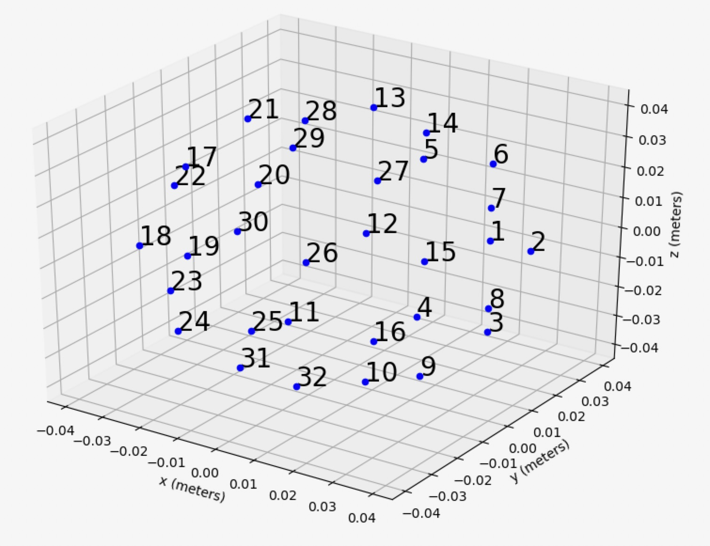

# micarraylib


**Python library to download, standardize, and aggregate existing microphone array recordings.** 

Using micarraylib, one can encode raw microphone array recordings across different datasets to be in the common ambisonics B-format. micarraylib also standardizes annotations to be in a common convention ([Soundata's Events class conventions](https://soundata.readthedocs.io)). 

Additionally, micarraylib organizes metadata (i.e. microphone capsule coordinates and hardware name) to be readily accessible. 

IMPORTANT: This software is fully-functional but still being developed and tested. As a result, it is in its pre-release stage. Use with caution (read [LICENSE](https://github.com/micarraylib/micarraylib/blob/main/LICENSE)). Suggestions, requests, and noted-issues are always welcome. 

## How to install

To install, first clone the repo, then navigate to the `micarraylib` directory, and install with pip in editable mode:

```
$ git clone https://github.com/micarraylib/micarraylib.git

$ cd micarraylib

$ pip install -e .
```

Also install all dependencies

## Tested dependencies

|           | version |
| --------- | ------- |
| Python    | 3.9.7   |
| librosa   | 0.8.1   |
| soundata  | 0.1.0   |
| spaudiopy | 0.1.4   |
| pytest    | 6.2.5   |

## Example use 1: Working with the 3D-MARCo dataset

The [3D-MARCo](https://pure.hud.ac.uk/en/datasets/3d-microphone-array-comparison-3d-marco) dataset consists of sound sources (live performances, as well as impulses and pre-recorded sources played with loudspeakers) imultaneously recorded by multiple microphone arrays.

* Start by loading the datasets module.

	```
	>>> from micarraylib import datasets
	```

* You can download and initialize the 3D-MARCO dataset. The data will be downloaded and unzipped to a directory called datasets in your home path (download may take a while).

	```
	>>> marco = datasets.marco(data_home='~/datasets')
	```

* Alternatively, just load the dataset if you already have it.

	```
	>>> marco = datasets.marco(download=False,data_home='~/datasets/marco')
	```

* Now you can list the microphone arrays available using.

	```
	>>> marco.array_names
	['OCT3D', 'Eigenmike', 'PCMA3D', 'DeccaCuboid', '2LCube', 'Ambeo', 'Hamasaki']
	```

* Each microphone array has a list of capsule names. For example, let's print the 'Ambeo' ones.

	```
	>>> marco.array_capsules['Ambeo']
	['Ch1:FLU', 'Ch2:FRD', 'Ch3:BLD', 'Ch4:BRU']
	```

* And each capsule has polar coordinates (colatitude radians, azimuth radians, and radius meters) associated with it.

	```
	>>> marco.capsule_coords['Ambeo']
	{'Ch1:FLU': [0.9599310885968811, 0.7853981633974483, 0.01], 'Ch2:FRD': [2.181661564992912, -0.7853981633974483, 0.01], 'Ch3:BLD': [2.181661564992912, 2.356194490192345, 0.01], 'Ch4:BRU': [0.9599310885968811, 3.9269908169872414, 0.01]}
	```

* You can easily plot any microphone array in the dataset to interactively visualize its geometry.

	```
	>>> marco.plot_micarray('Eigenmike')
	```
				
	

* The dataset is made of sound sources that were recorded by all microphone arrays simultaneously. You can list all available sound sources (more details in the official [3D-MARCo documentation](https://zenodo.org/record/3477602#.YZBqbC1h1pS)).

	```
	>>> marco.clips_list
	['impulse_response+45d', 'single_sources-75d', 'impulse_response-90d', 'impulse_response-30d', 'single_sources-15d', 'single_sources-30d', 'organ', 'impulse_response0deg', 'acapella', 'single_sources-90d', 'piano_solo_2', 'impulse_response-75d', 'impulse_response+75d', 'impulse_response+15d', 'single_sources-45d', 'single_sources0deg', 'single_sources-60d', 'impulse_response-45d', 'impulse_response+60d', 'impulse_response-60d', 'piano_solo_1', 'impulse_response+90d', 'trio', 'quartet', 'impulse_response-15d', 'impulse_response+30d']
	```

* You can load the audio of any of these sound sources (as a numpy array), recorded by any microphone array in the dataset in A-format (raw capsules).

	```
	>>> marco.get_audio_numpy('organ','Ambeo',fmt='A')
	```

* Or B-format using micarraylib's simple encoder and specifying an ambisonics order N (N3D-ACN convention).

	```
	>>> marco.get_audio_numpy('organ','OCT3D',fmt='B',N=2)
	```

* You can also easily get a numpy array with the capsule coordinates in polar form and a list with the capsule names that correspond to each row in the numpy array.

	```
	>>> coords_numpy, capsule_names_list = marco.get_capsule_coords_numpy('OCT3D',fmt='B',N=2)

	>>> print(coords_numpy)
	[[ 2.33401311  0.85309119  0.64295806]
	 [ 2.33401311 -0.85309119  0.64295806]
	 [ 2.46685171  0.          0.5691666 ]
	 [ 2.28874417  1.75748566  0.67561129]
	 [ 2.28874417  4.52569965  0.67561129]
	 [ 0.81203798  1.02224692  0.80746899]
	 [ 0.81203798 -1.02224692  0.80746899]
	 [ 0.99496437  2.5175696   1.02024265]
	 [ 0.99496437  3.76561571  1.02024265]]

	>>> print(capsule_names_list)
	['FL', 'FR', 'FC', 'RL', 'RR', 'FLh', 'FRh', 'RLh', 'RRh'] 
	```

* NOTE: under the hood, `micarraylib` obtains the 3D-MARCo data using [Soundata's 3D-MARCo loader](https://soundata.readthedocs.io/en/latest/source/soundata.html#module-soundata.datasets.marco). The same is true for all other datasets supported by `micarraylib`.

## Example use 2: Working with the 2021 DCASE Challenge Task 3 dataset

Please refer to the [official 2021 DCASE Challenge Task 3 website](http://dcase.community/challenge2021/task-sound-event-localization-and-detection) to learn more about the dataset.

* Start by loading the datasets module.

	```
	>>> from micarraylib import datasets
	```

* You can download and initialize the 2021 DCASE Challenge task 3. The data will be downloaded and unzipped to a directory called datasets in your home path (download may take a while).

	```
	>>> tau = datasets.tau2021sse_nigens(data_home='~/datasets')
	```

* Alternatively, just load the dataset if you already have it.

	```
	>>> tau = datasets.tau2021sse_nigens(download=False,data_home='~/datasets/tau2021sse_nigens')
	```

* Now you can list the only microphone array available using.

	```
	>>> tau.array_names
	['Eigenmike']
	```

* The dataset is made of clips. The list of all clips is very big (800 total). Printing it is possible but impractical. Instead, if you want to understand the clip ids, we recomend studying the [dataset's full index](https://github.com/soundata/soundata/blob/main/soundata/datasets/indexes/tau2021sse_nigens_index.json). Some example clip ids that `micarraylib` recognizes in this dataset are `dev/dev-train/fold1_room1_mix001` or `eval/eval-test/mix124`.

* You can load the audio of any of these clip ids (as a numpy array), recorded by the microphone array in the dataset in A-format (raw capsules).

	```
	>>> tau.get_audio_numpy('dev/dev-train/fold1_room1_mix001',fmt='A')
	```

* Or B-format. In this case, since the dataset is readily available in both A and B formats, `micarraylib`'s simple encoder is not used.

	```
	>>> tau.get_audio_numpy('dev/dev-train/fold1_room1_mix001',fmt='B')
	```

* You can also get Soundata's [`SpatialEvents`](https://soundata.readthedocs.io/en/latest/source/soundata.html#soundata.datasets.tau2021sse_nigens.Clip.spatial_events) object associated with the clip id. This contains all the annotations of spatial events present in the dataset. 

	```
	>>> tau.get_audio_events('dev/dev-train/fold1_room1_mix001')
	```
## Example use 3: Aggregating the 2019, 2020, and 2021 DCASE Challenge Task 3 datasets on a single object. 

`micarraylib` also has an `Aggregate` class that can be used to combine datasets. 

* First, define the datasets you want to aggregate (this specific code will also download them).

	```
	>>> from micarraylib import datasets

	>>> tau2019 = datasets.tau2019sse(data_home='~/datasets')
	>>> tau2020 = datasets.tau2020sse_nigens(data_home='~/datasets')
	>>> tau2021 = datasets.tau2021sse_nigens(data_home='~/datasets')
	```
* Then define a list of datasets to be aggregated

	```
	>>> datasets_list = [tau2019, tau2020, tau2021]
	```

* Next, create the `Aggregate` instance. You should specify the sampling rate that will be applied to all audio files across the datasets in the `Aggregate`.

	```
	>>> from micarraylib.core import Aggregate
	
	>>> agg = Aggregate(datasets_list,fs=8000)	
	```

* Now you can access all `micarraylib` dataset objects in the aggregate by their identifier, and use them as normal. Again, any audio data you retrieve will reflect the sampling rate you specified in the previous step. Example:

	```
	>>> agg.datasets['tau2021sse_nigens'].get_audio_numpy('dev/dev-train/fold1_room1_mix001',fmt='B')
	```

## Supported datasets

| Dataset name      | micarraylib/soundata identifier  |
| ----------------- | -------------------------------- |
| DCASE task 3 2019 | `tau2019sse`                     |
| DCASE task 3 2020 | `tau2020sse_nigens`              |
| DCASE task 3 2021 | `tau2021sse_nigens`              |
| 3D-MARCo          | `marco`                          |
| EigenScape        | `eigenscape` and `eigenscape_raw`|

## Citing
```
@article{roman2021micarraylib,
  title={Micarraylib: Software for Reproducible 
  Aggregation, Standardization, and Signal 
  Processing of Microphone Array Datasets},
  author={Roman, Iran R and Bello, Juan Pablo},
  year={2021},
}
```
[Our DCASE 2021 paper can be found here](http://dcase.community/documents/workshop2021/proceedings/DCASE2021Workshop_Roman_59.pdf). 

NOTE: the example code in the paper is OUTDATED.

## Test coverage

```
----------- coverage: platform linux, python 3.9.7-final-0 -----------
Name                                               Stmts   Miss  Cover
----------------------------------------------------------------------
micarraylib/__init__.py                                0      0   100%
micarraylib/arraycoords/__init__.py                   22      0   100%
micarraylib/arraycoords/array_shapes_raw.py            8      0   100%
micarraylib/arraycoords/array_shapes_utils.py         16      0   100%
micarraylib/arraycoords/core.py                       37      0   100%
micarraylib/core.py                                   48      2    96%
micarraylib/datasets/__init__.py                      17      0   100%
micarraylib/datasets/eigenscape_loader.py             44      0   100%
micarraylib/datasets/marco_loader.py                  30      0   100%
micarraylib/datasets/tau2019sse_loader.py             33      0   100%
micarraylib/datasets/tau2020sse_nigens_loader.py      33      0   100%
micarraylib/datasets/tau2021sse_nigens_loader.py      33      0   100%
micarraylib/utils.py                                  33      0   100%
----------------------------------------------------------------------
TOTAL                                                354      2    99%
```
We have worked hard to test our work in `micarraylib` so far, but we can always improve. Please help us writting tests to make `micarraylib` more robust. All constructive contributions and feedback are always welcome.

## License
Shield: [![CC BY 4.0][cc-by-shield]][cc-by]

This work is licensed under a
[Creative Commons Attribution 4.0 International License][cc-by].

[![CC BY 4.0][cc-by-image]][cc-by]

[cc-by]: http://creativecommons.org/licenses/by/4.0/
[cc-by-image]: https://i.creativecommons.org/l/by/4.0/88x31.png
[cc-by-shield]: https://img.shields.io/badge/License-CC%20BY%204.0-lightgrey.svg
